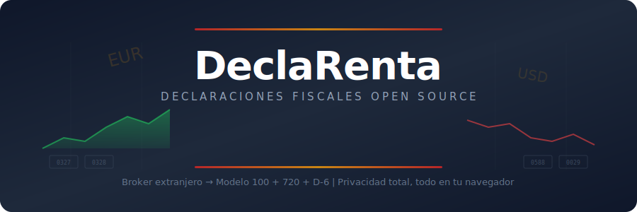

<p align="center">
  
</p>

<p align="center">
  
</p>

<h1 align="center">DeclaRenta</h1>

<p align="center">
  <strong>Convierte reportes de brokers extranjeros en tu declaración de la renta española.</strong>
</p>

<p align="center">
  <a href="https://declarenta.com"></a>
  <a href="https://github.com/GeiserX/DeclaRenta/blob/main/LICENSE"></a>
  <a href="https://codecov.io/gh/GeiserX/DeclaRenta"></a>
  <a href="https://github.com/GeiserX/DeclaRenta/actions"></a>
  <a href="https://github.com/GeiserX/DeclaRenta/stargazers"></a>
  <a href="https://github.com/GeiserX/awesome-spain#readme"></a>
</p>

<p align="center">
  <a href="https://declarenta.com"><strong>declarenta.com</strong></a> — Úsalo gratis, sin registro
</p>

<p align="center">
  IBKR · Degiro · Scalable Capital · eToro · Freedom24 · Coinbase · Binance · Kraken → Modelo 100 · Modelo 720 · Modelo 721 · D-6
</p>

<p align="center">
  Self-hosted · Privacidad total · Tus datos no salen de tu equipo
</p>

---

## El problema

Si inviertes con un broker extranjero, hacer la renta es un infierno:

- **Renta Web no importa datos** de brokers extranjeros — todo manual
- **FIFO obligatorio** con tipos ECB oficiales (no los del broker)
- **Regla anti-churning** de 2 meses que nadie detecta automáticamente
- **Doble imposición** internacional que hay que calcular a mano
- **Modelo 720** obligatorio si tus activos en el extranjero superan 50.000 EUR
- **Modelo D-6** para titulares de valores extranjeros a 31 de diciembre (verificar normativa vigente)

DeclaRenta automatiza todo esto.

## Brokers soportados

| Broker | Formato | Notas |
|---|---|---|
| Interactive Brokers | Flex Query XML | Trades, dividendos, corporate actions, posiciones |
| Degiro | CSV (transacciones + cartera) | Delimitador auto-detectado (coma/punto y coma) |
| Scalable Capital | CSV (14 columnas) | Incluye savings plans y distribuciones |
| eToro | XLSX (cuenta completa) | Posiciones cerradas + dividendos + CFDs, 6+ versiones de cabeceras |
| Freedom24 | JSON (report export) | Trades, dividendos, retenciones |
| Coinbase | CSV (historial de transacciones) | Crypto trades y conversiones |
| Binance | CSV (historial de trades) | Spot trades de criptomonedas |
| Kraken | CSV (trades/ledger) | Crypto trades y staking |

Se pueden combinar ficheros de varios brokers en una sola ejecución para FIFO cruzado.

## Modelos fiscales

| Modelo | Descripción | Formato |
|---|---|---|
| **Modelo 100** (IRPF) | Casillas 0327, 0328, 0029, 0032, 0033, 0358, 0588 | JSON, CSV, PDF (con tipos ECB) |
| **Modelo 720** | Declaración de bienes en el extranjero (>50.000 EUR), tipos A/M/C | Fixed-width AEAT (validado contra spec BOE) |
| **Modelo 721** | Declaración de criptomonedas en el extranjero (>50.000 EUR) | Fixed-width AEAT |
| **Modelo D-6** | Inversiones en el exterior (Banco de España / AFORIX) | JSON o guía paso a paso |

## Casillas del Modelo 100

| Casilla | Concepto |
|---|---|
| 0327 | Valor de transmisión (importe total de ventas) |
| 0328 | Valor de adquisición (coste total FIFO con tipos ECB) |
| 0029 | Dividendos brutos de acciones extranjeras |
| 0032 | Gastos deducibles (intereses de margen) |
| 0033 | Intereses de cuentas y depósitos |
| 0358 | Pérdidas patrimoniales a compensar (bloqueadas por regla anti-churning) |
| 0588 | Deducción por doble imposición internacional |

## Interfaz web

La web incluye:

- **Wizard guiado**: subida de ficheros → revisión de datos → resultados con casillas detalladas
- **Guías por broker**: instrucciones paso a paso para obtener el informe de cada broker
- **Perfil fiscal**: NIF, nombre, CCAA y teléfono para generar 720/D-6 correctamente
- **Secciones dedicadas**: Modelo 100, Modelo 720, Modelo D-6 con navegación lateral
- **Gráficas interactivas**: distribución por activo, G/P mensual, composición de divisas, retenciones por país
- **Comparativa interanual**: guarda informes en localStorage y compara variaciones año a año
- **Detalle de casillas**: desplegable con explicación de cada casilla y su normativa
- **PWA instalable**: funciona offline tras la primera visita
- **Tema claro/oscuro**
- **5 idiomas**: español, inglés, catalán, euskera, gallego

## Inicio rápido

### Web (recomendado)

Visita [declarenta.com](https://declarenta.com) — arrastra tus ficheros y listo.

Soporta `.xml`, `.csv`, `.json` y `.xlsx`. Se pueden subir varios ficheros a la vez para FIFO cruzado entre brokers.

### Docker

```bash
# Web (nginx)
docker run -p 8080:80 drumsergio/declarenta:web

# CLI
docker run --rm -v $(pwd):/data drumsergio/declarenta convert --input /data/flex_query.xml --year 2025
```

### CLI

```bash
git clone https://github.com/GeiserX/DeclaRenta.git
cd DeclaRenta && npm install && npm run build

# Informe Modelo 100 (JSON a stdout)
node dist/cli.js convert --input flex_query.xml --year 2025

# Varios ficheros de distintos brokers
node dist/cli.js convert --input ibkr.xml --input degiro.csv --input etoro.xlsx --year 2025

# Exportar en CSV
node dist/cli.js convert --input flex_query.xml --year 2025 --format csv --output detalle.csv

# Exportar en PDF
node dist/cli.js convert --input flex_query.xml --year 2025 --format pdf --output informe.pdf

# Con compensación de pérdidas de años anteriores (Art. 49 LIRPF)
node dist/cli.js convert --input flex_query.xml --year 2025 --prior-losses perdidas.json

# Modelo 720
node dist/cli.js modelo720 --input flex_query.xml --year 2025 --nif 12345678A --name "APELLIDOS, NOMBRE"

# Modelo 720 con tipos A/M/C (comparando con declaración del año anterior)
node dist/cli.js modelo720 --input flex_query.xml --year 2025 --nif 12345678A --name "APELLIDOS, NOMBRE" --previous-720 720_2024.txt

# Modelo D-6 (guía AFORIX)
node dist/cli.js d6 --input flex_query.xml --year 2025 --nif 12345678A --name "APELLIDOS, NOMBRE"

# Modelo D-6 con detección de bajas (comparando con año anterior)
node dist/cli.js d6 --input flex_query.xml --year 2025 --nif 12345678A --name "APELLIDOS, NOMBRE" --previous-d6 d6_2024.json --format json
```

El broker se auto-detecta a partir del contenido del fichero. Se puede forzar con `--broker <nombre>`.

## Motor fiscal

- **FIFO estricto** con tipos de cambio ECB oficiales por fecha de operación
- **Todos los tipos de activo**: acciones, ETFs, opciones, futuros, forex, bonos, CFDs y criptomonedas
- **Regla anti-churning** (Art. 33.5.f LIRPF): bloqueo de pérdidas si se recompra el mismo valor en 2 meses (aplica a acciones, fondos y bonos; excluye derivados, forex y crypto)
- **Doble imposición** (Art. 80 LIRPF): deducción por retenciones en origen, desglosado por país
- **Stock splits**: forward y reverse, con liquidación de fracciones (cash-in-lieu)
- **Corporate actions**: fusiones (transferencia de coste) y spin-offs (distribución proporcional)
- **Compensación de pérdidas** (Art. 49 LIRPF): ventana de 4 años con compensación cruzada del 25%
- **Validador Modelo 720**: verificación contra la especificación BOE del formato de registro

## Privacidad

- **Self-hosted**: los datos se procesan en tu equipo. La única conexión externa es al API del BCE para tipos de cambio (datos públicos).
- Sin analytics, sin tracking, sin telemetría.
- La interfaz web muestra la versión y commit exacto desplegado — puedes verificar que coincide con el código fuente en GitHub.

## Desarrollo

```bash
git clone https://github.com/GeiserX/DeclaRenta.git
cd DeclaRenta
npm install

npm test              # Ejecuta la suite de tests
npm run dev           # Servidor web de desarrollo
npm run build         # Build completo (lib + web)
npm run lint          # ESLint
npm run typecheck     # TypeScript
node dist/cli.js convert --input test.xml --year 2025
```

## Contribuir

Las contribuciones son bienvenidas. Áreas donde más ayuda se necesita:

- **Parsers de brokers**: Trade Republic, Revolut, XTB, MyInvestor
- **Reglas fiscales**: casos edge de FIFO, convenios de doble imposición por país
- **Tests**: más fixtures con operaciones reales anonimizadas
- **Traducciones**: las traducciones a catalán, euskera y gallego son automáticas — se necesita revisión por hablantes nativos

## Sponsor

Si DeclaRenta te ahorra tiempo (y dinero), considera apoyar el proyecto:

[](https://github.com/sponsors/GeiserX)
